# 🌱 Mitti Mitra – AI-Powered Smart Agriculture Assistant

<div align="center">

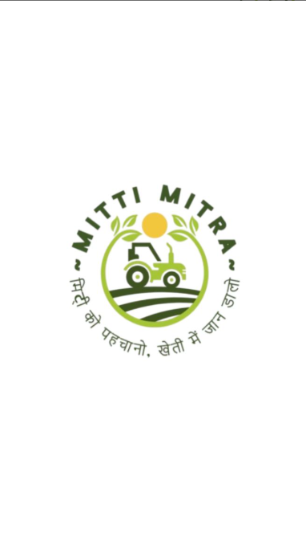

### Empowering Farmers Through Intelligent Technology


An AI-powered Android application designed to assist farmers with smart crop management, soil health monitoring, irrigation planning, fertilizer recommendations, pest control guidance, and intelligent agricultural support.

</div>

---

# 📖 Overview

Mitti Mitra is a smart agriculture mobile application developed to support farmers through data-driven decision-making and AI-powered recommendations.

The application integrates multiple agricultural services into a single platform, helping users monitor soil health, manage crops efficiently, optimize irrigation schedules, receive fertilizer and pesticide recommendations, predict crop nutrition, and interact with an AI agricultural assistant.

The project demonstrates the practical application of mobile development, Firebase integration, agricultural analytics, and intelligent recommendation systems in modern farming.

---

# ✨ Key Features

## 🌐 Multi-Language Support
- English Interface
- Hindi Interface

## 🔐 User Authentication
- Secure Login
- User Registration
- Password Management
- User Profile System

## 🌾 Crop Management
- Crop Selection
- Crop Monitoring
- Frequently Used Crops Dashboard

## 📊 Soil Health Monitoring
Track essential soil parameters:

- Nitrogen (N)
- Phosphorus (P)
- Potassium (K)
- Moisture
- Humidity
- pH Levels
- Total Dissolved Solids (TDS)

## 📈 Sensor Analytics
- Real-Time Monitoring
- Historical Data Analysis
- Trend Visualization
- Smart Alerts

## 🌿 Fertilizer Recommendation System
Provides:

- NPK Analysis
- Fertilizer Recommendations
- Application Quantity
- Application Timing
- Best Practices Guidance

## 🐛 Pesticide Recommendation System
Provides:

- Pest Identification Support
- Pesticide Recommendations
- Dosage Instructions
- Application Guidelines
- Safety Precautions

## 💧 Irrigation Management
- Moisture Tracking
- Smart Watering Schedule
- Irrigation Alerts
- Real-Time Monitoring

## 🥬 Nutritional Value Prediction
- Soil Health Scoring
- Nutrient Analysis
- Crop Nutrition Forecasting

## 📦 Shelf-Life Improvement System
- Shipment Acidity Planning
- Post-Harvest Guidance
- Storage Recommendations

## 🤖 AgriBot – AI Farming Assistant
- Agricultural Question Answering
- Soil Analysis Assistance
- Farming Guidance
- Crop Recommendations
- Intelligent Support System

## 👤 Profile Management
- User Information
- Historical Data
- Saved Preferences
- Account Settings

---

# 🏗️ System Architecture

```text
Mitti Mitra
│
├── Authentication Module
├── Language Selection Module
├── Dashboard Module
├── Soil Monitoring Module
├── Sensor Analytics Module
├── Crop Management Module
├── Fertilizer Recommendation Module
├── Pesticide Recommendation Module
├── Irrigation Management Module
├── Nutritional Prediction Module
├── Shelf-Life Optimization Module
├── AI Chatbot Module
└── Profile Management Module
```

---

# 📱 Application Screenshots

<table>
<tr>
<td align="center">
<b>Splash Screen</b><br>

</td>

<td align="center">
<b>Language Selection</b><br>
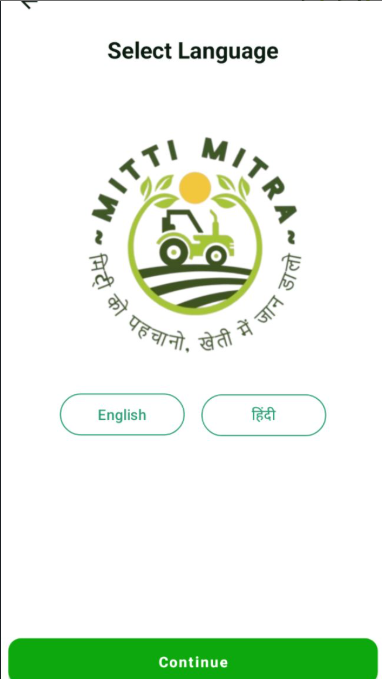
</td>

<td align="center">
<b>Login Screen</b><br>

</td>
</tr>

<tr>
<td align="center">
<b>Registration</b><br>

</td>

<td align="center">
<b>Crop Selection</b><br>
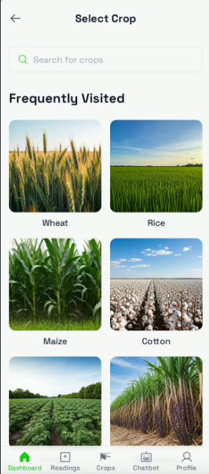
</td>

<td align="center">
<b>Dashboard</b><br>
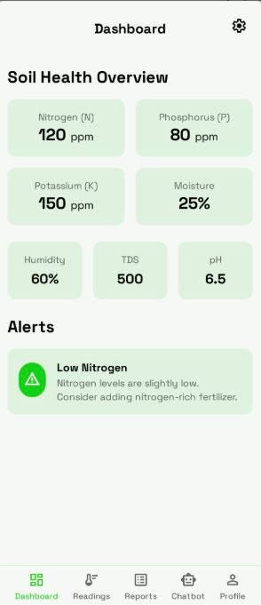
</td>
</tr>

<tr>
<td align="center">
<b>Sensor Readings</b><br>
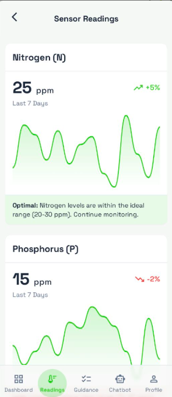
</td>

<td align="center">
<b>Recommendations</b><br>
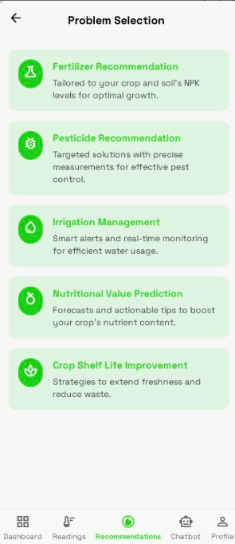
</td>

<td align="center">
<b>Fertilizer Module</b><br>
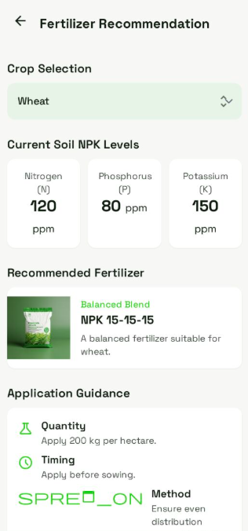
</td>
</tr>

<tr>
<td align="center">
<b>Pesticide Module</b><br>
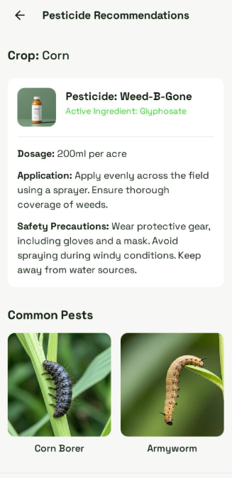
</td>

<td align="center">
<b>Irrigation Management</b><br>
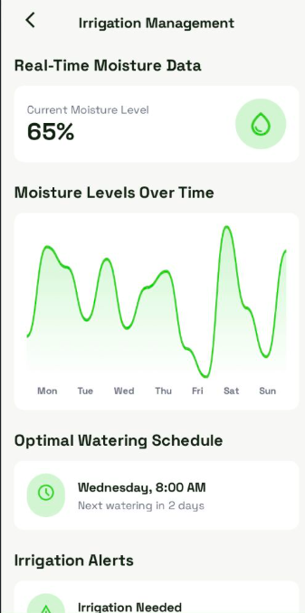
</td>

<td align="center">
<b>Nutrition Prediction</b><br>
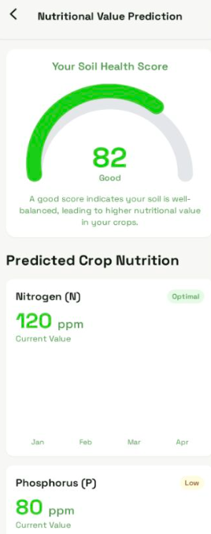
</td>
</tr>

<tr>
<td align="center">
<b>Shelf Life Optimization</b><br>
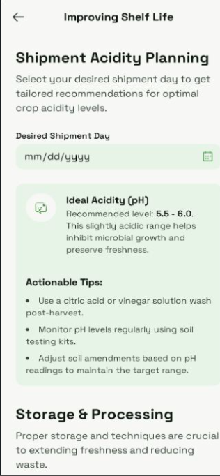
</td>

<td align="center">
<b>AgriBot Assistant</b><br>
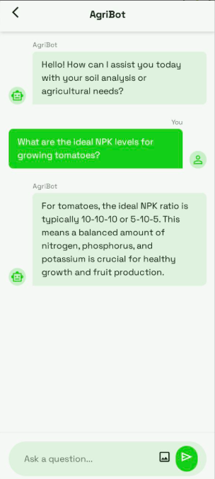
</td>

<td align="center">
<b>User Profile</b><br>

</td>
</tr>
</table>

---

# 🛠️ Technology Stack

## Mobile Development
- Java
- XML
- Android SDK

## Backend Services
- Firebase Authentication
- Firebase Realtime Database

## Development Tools
- Android Studio
- Gradle

## Architecture
- Activity-Based Architecture
- Modular Design Pattern

---

# 🎯 Objectives

- Improve agricultural productivity
- Enable data-driven farming decisions
- Optimize irrigation management
- Reduce fertilizer wastage
- Improve crop quality
- Provide intelligent agricultural assistance
- Support sustainable farming practices

---

# 🚀 Future Enhancements

- IoT Sensor Integration
- Weather Forecast Integration
- AI Disease Detection
- Voice-Based Agricultural Assistant
- Market Price Prediction
- Crop Yield Prediction
- Multi-Language Expansion
- Cloud Analytics Dashboard

---

# 📂 Project Structure

```text
Mitti-Mitra
│
├── app/
├── gradle/
├── screenshots/
│   ├── splash.png
│   ├── login.png
│   ├── dashboard.png
│   └── ...
│
├── .gitignore
├── build.gradle.kts
├── gradle.properties
├── gradlew
├── gradlew.bat
├── settings.gradle.kts
└── README.md
```

---

# 👨‍💻 Contributors

### Shivam Kapoor
B.Tech Computer Science Engineering  
Bennett University

### Project Team
Developed as part of an academic and innovation-focused smart agriculture project.

---

# 🌟 Highlights

✅ Smart Agriculture Application

✅ AI-Powered Farming Assistance

✅ Firebase Authentication Integration

✅ Soil Health Monitoring

✅ Fertilizer & Pesticide Recommendations

✅ Irrigation Planning System

✅ Crop Nutritional Analysis

✅ Modern Android UI/UX

---

# ⭐ Support the Project

If you found this project useful:

- ⭐ Star this repository
- 🍴 Fork this repository
- 🚀 Contribute to future improvements

---

# 📄 License

This project is intended for educational, research, and innovation purposes.

---

<div align="center">

## 🌱 Smart Farming • Better Decisions • Better Harvests

### Mitti Mitra

Made with ❤️ for Agriculture and Technology

</div>
